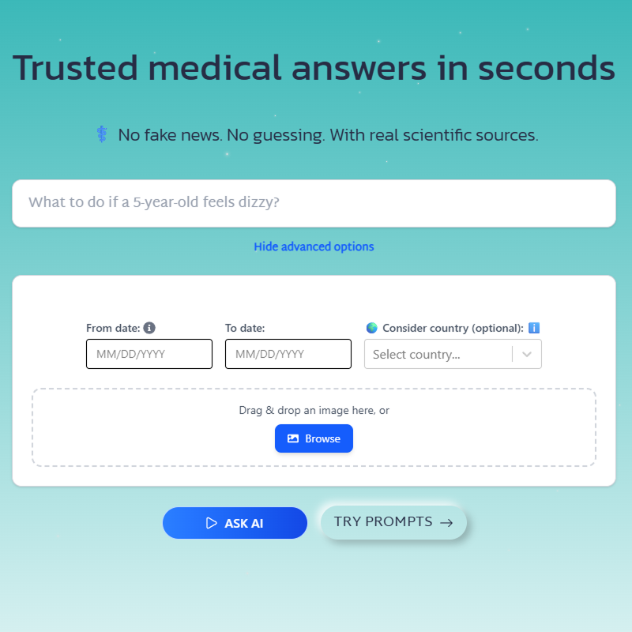
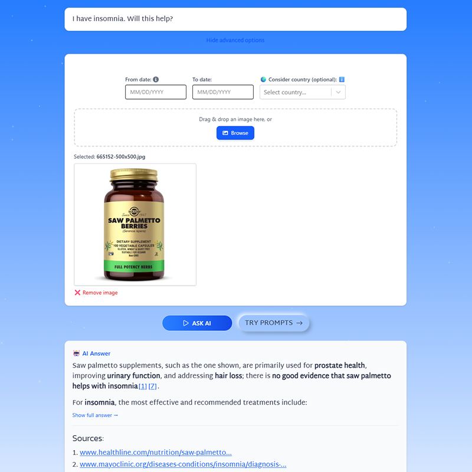
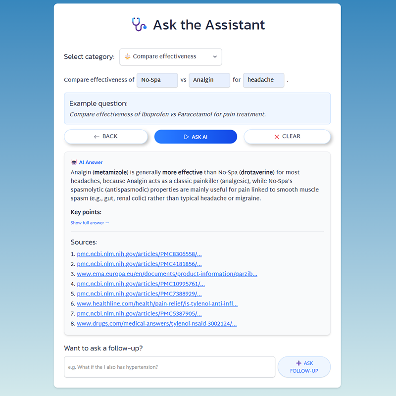

# 🩺 Valetudo AI — Trusted Medical Answer Assistant

**Valetudo AI** is a Perplexity Sonar-powered assistant that delivers science-backed, fast, and clear medical answers. It helps reduce misinformation by providing citations from verified sources — with support for filters by date, country, and even image upload.

The name *Valetudo* comes from Latin and means “health” 🩺. The project is designed for conscious users seeking reliable medical information: caring parents, patients, and medical students. Ask about symptoms, drug interactions, or safe alternatives — and get trustworthy answers instantly.

## 🎥 Demo Video

Watch Valetudo AI in action 👇:

[](https://www.youtube.com/watch?v=AX3nOh9LbTc)

## 🎯 Key Features

- Chat with AI using **Perplexity Sonar Pro**
- Answers with numbered scientific citations
- **Limited to 10 trusted sources** for clarity
- Filters by **date** and **user location**
- **Image upload** for visual context (e.g. meds or conditions)
- **Prompt templates** (7 categories) for common medical queries:
	-   Symptom-based advice
	-   Drug interaction checks
	-   Safety timing
	-   Safer treatments
	-   Compare effectiveness
	-   Recommended exercises
	-   Latest research
- Follow-up input to clarify or expand your question
- Prioritization of **local sources** when a country is selected
- **Markdown formatting** and clean tables
- Easily copy and open source links
- Simple and user-friendly interface

> Ask questions. Get trusted answers in seconds.



### 🔧 Integrated Features (per [Perplexity API documentation](https://docs.perplexity.ai)):

| Feature | API Field |
|--|--|
| Search Context Size | `search_context_size: medium` |
| Domain Filtering | `search_domain_filter` |
| Image Upload | `image_url` |
| Date Filtering | `search_after/before_date_filter` |
| User Location Filter | `user_location` |

> Upload an image — AI will analyze it too.

 

## 🧠 Tech Stack

-   **Frontend**: React, Vite, Tailwind CSS
-   **AI Integration**: Perplexity Sonar Pro API
-   **Markdown Renderer**:  React Markdown, rehype-raw
-   **UI Framework:** React Select, React Icons, React Datepicker
-   **Image handling**: base64 encoder and preview
-   **Backend:** Python, Flask (proxy for API calls)


## 🚀 Local Setup

### 1. Clone the repo

```bash
git clone https://github.com/vero-code/valetudo-ai.git
cd valetudo-ai
```

### 2. Set environment variables

Create a `.env` file inside the `/backend` folder:

`PERPLEXITY_API_KEY=your_api_key_here` 

> 🔒 Refer to `/backend/.env.example`

> 📘 [How to get your API key](https://docs.perplexity.ai/guides/getting-started#generating-an-api-key)

> ⚠️ Never commit your `.env` file to version control.


### 3. Start the frontend

```sh
npm install 
npm run dev
```

### 4. Start the backend

```sh
cd backend
python -m venv venv
venv\Scripts\activate     # On Windows
# OR
source venv/bin/activate  # On macOS/Linux

pip install -r requirements.txt
python app.py
```

The app will be available at [http://localhost:5173](http://localhost:5173)


## ☁️ Deployment (Vercel)

The project is configured for easy deployment to **Vercel** as a monorepo (Frontend + Python Serverless Backend).

### 1. Install Vercel CLI (optional)
```sh
npm i -g vercel
```

### 2. Deploy
Run the following command in the root directory:
```sh
vercel
```

### 3. Set Environment Variables
In your Vercel Dashboard, go to **Settings -> Environment Variables** and add:
- `PERPLEXITY_API_KEY`: Your Perplexity API key.

### 4. Production Build
For the final production deployment:
```sh
vercel --prod
```


## 🧪 Testing the App

### 1. Ask a health question

-   Example: `What to do if a 5-year-old has a fever?`
-   Click **"Ask AI"** and expand the full answer
-   Hover over citation numbers to preview and copy links

### 2. Use filters

-   Click **"Show advanced options"**
-   Set a custom date range
-   Choose a country for localized results
    
### 3. Upload an image

-   Drag and drop an image or upload manually
-   Ask: `What is this medication?`
-   The AI will include visual analysis

### 4. Try prompt templates

-   Click **"Try Prompts"**
-   Choose a category, fill in the fields, and generate a ready-to-send query
-   Use the **Follow-up** input to deepen the conversation

> Save time with prompts and follow-up questions.




## 📁 Project Structure

```
valetudo-ai/

├── backend/         # Flask backend API
├── public/          # Static files
├── screenshots/     # UI Images
├── src/
│ ├── assets/        # Media resources
│ ├── components/    # React components
│ ├── constants/     # Mock data and templates
│ ├── hooks/         # Custom React hooks
│ ├── utils/         # Helper functions
│ ├── App.jsx        # Routes
│ ├── index.css      # Styles
│ └── main.jsx       # App entry point
├── index.html       # Main HTML file
├── LICENSE          # License file
├── package.json     # Dependencies
├── README.md        # Documentation
└── vite.config.js   # Vite config
```


## 🔧 Key Components

-   `HeroSection` — landing section with input, filters, and image upload
-   `AskPage` — category-based prompt system with follow-up form
-   `QuickAnswerBox` — renders AI response with Markdown + citation links


## 🔒 Security

-   No user data is stored
-   `.env` securely manages API key
-   Rate limits and usage caps can be added in production


## 🧩 Limitations

-   Not a diagnostic tool — for informational use only
-   Response time may vary with filters or image uploads
-   Mobile layout is simplified (desktop-first)

**Disclaimer**: This is not a medical device. Always consult a doctor for clinical decisions.


## 🏁 License

MIT License — free to use, modify, and distribute, **with attribution**.


## 🤝 Attribution

Built with ❤️ for the [**Perplexity Global Hackathon**](https://devpost.com/software/valetudo-ai)

Powered by the Sonar API